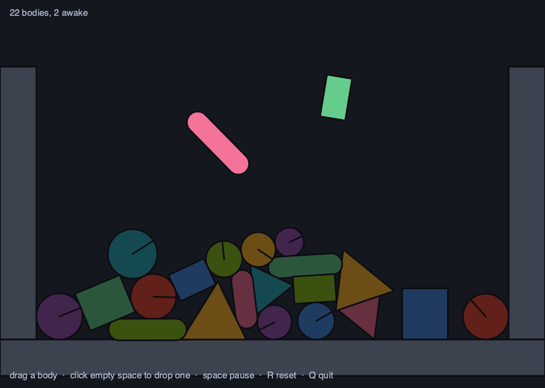

# box2d-demo

A playground for [**box2d**](https://github.com/sysl-lang/box2d) — grab a body and throw it, drop
more in, watch the pile go to sleep. [**cairo**](https://github.com/sysl-lang/cairo) cuts the shapes,
[**sdl3**](https://github.com/sysl-lang/sdl3) turns the crank.



```
brew install cairo sdl3
sysl run . --link-path /opt/homebrew/lib \
           --include-path cairo=/opt/homebrew/include/cairo \
           --include-path sdl3=/opt/homebrew/include
```

| | what it does |
|---|---|
| drag a body | grab it with a mouse joint and throw it |
| click empty space | drop a new circle, box, capsule or triangle there |
| `space` | pause |
| `R` | a fresh pile |
| `Q` | quit |

`--shot` runs the simulation to a fixed state, writes `demo.png` and exits. That is how the image
above is made, and it is the reason it cannot go stale without somebody noticing.

## Three packages, and nothing between them

**box2d** decides where everything is. **cairo** draws it. **sdl3** opens the window, reads the mouse
and puts the pixels up. None of the three knows the others exist.

The join between the last two is **one buffer of ARGB32 pixels**. That is cairo's native format and
one of SDL's texture formats, and on a little-endian machine both mean the bytes B, G, R, A — so
nothing is converted, and the texture is uploaded straight out of cairo's own storage every frame:

```
cairo draws into an image surface -> surface.data() -> texture.update() -> present
```

`box2d` needs nothing installed at all; it carries Box2D's own C. The other two want a library this
machine has to have, and each declares by name the header it needs, so forgetting a path is refused
by a sentence naming the library rather than by clang reporting a file nobody wrote.

## Drawn in metres, not in pixels

Box2D works in metres and cairo works in whatever the current matrix says, so the matrix is set once
per frame:

```sysl
cr.translate(ORIGIN_X, ORIGIN_Y)
cr.scale(SCALE, -SCALE)
```

Every shape is then drawn at the coordinates the simulation actually holds. **The negative y scale is
the whole of the coordinate conversion** — Box2D's y points up and a window's points down — and there
is no `to_screen` helper anywhere in the program. A line width is in metres too, which is what keeps
an outline the same thickness relative to the bodies rather than to the window.

The one place the conversion is done by hand is the other direction, turning a cursor position back
into a world point, which is four lines at the bottom of the file.

## What is worth watching

**A body that has stopped moving dims.** That is Box2D putting it to sleep: it has been nearly still
for half a second and now costs the solver nothing until something touches it. Grab a sleeping body
and the whole pile wakes. Nothing in the binding's tests makes that visible, and it is one of the
engine's better properties — the screenshot above is twenty bodies asleep with two still falling.

**A white ring flashes where something lands hard.** Those are contact *hit* events, which arrive as
an array after the step carrying the point and the approach speed. In a game this is where a sound
would be triggered. They are copied out of the event array the moment the step returns, because an
event is reported for the one step it happened in and a ring that lived a sixtieth of a second would
never be seen.

**A capsule is drawn by stroking, not by filling.** A capsule *is* the set of points within a radius
of a segment, so a round-capped stroke of the right width is exact — where filling it as a path would
mean two arcs and two tangent lines computed by hand.

## Two things the program does not do, on purpose

**It keeps no list of bodies.** Every frame it asks the world what overlaps the visible region and
draws that. It is the same query a real game would use to decide what to draw, and it means nothing
here can hold a body that has been removed.

**Picking is two questions rather than one.** `overlap_aabb` is a broad-phase query and answers in
bounding boxes, so it reports shapes whose box covers the cursor but whose geometry does not;
`test_point` then asks the exact question of each candidate. Asking the exact question of every shape
in the world is the alternative, and avoiding it is what a broad phase is for.

## The drag is one joint

There is no drag state in this program beyond `Option[MouseJoint]`, because **the joint is the drag**.
Pressing makes one, moving sets its target, releasing removes it:

```sysl
scene.held = Some(mouse_joint(scene.anchor, body, at, hertz = 5.0, damping_ratio = 0.7,
                              max_force = 1000.0 * body.mass()))
```

`max_force` is scaled to the body's mass so that a heavy body is dragged as firmly as a light one
rather than trailing behind the cursor. It is a soft constraint on purpose — a rigid one would let
you shove a body through a wall.

## Licence

ISC. See `LICENSE`.
